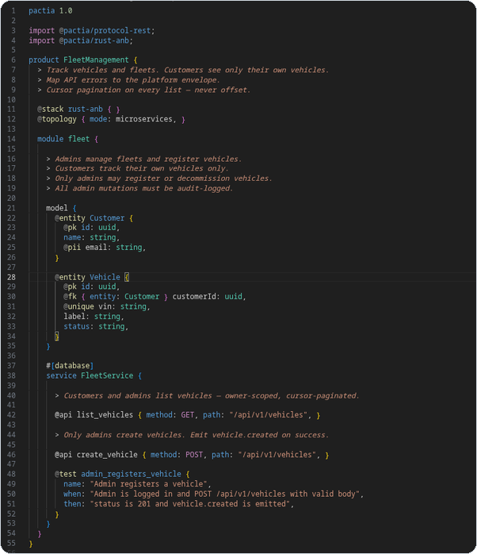

# Pactia

### The intent language for the AI era

**You write what must stay true. AI writes how it works.**

Like Rust is compiled by `rustc` and shared on crates.io — Pactia is an **AI-native programming language** compiled by **pactiac**, managed by **pactia**, with packages on **pactia.io**.

---

### The problem

Every AI coding session starts cold. Agents re-read scattered READMEs, stale OpenAPI, old ADRs, and Slack threads — then guess. Auth drifts. Pagination diverges. Event shapes disagree. Senior engineers fix what the model invented instead of shaping what matters.

The model is not the problem. **Durable product intent lives nowhere.**

---

### A new paradigm

| Era | You write | The machine |
| --- | --- | --- |
| 3GL — C, Rust | Algorithms + types | Executes |
| 4GL — SQL, Terraform | Desired state | Reconciles |
| **Pactia** | **Intent — what must stay true** | **Implements; tooling verifies** |

Pactia does not replace Rust, TypeScript, or Swift. It sits **above** them — a versioned layer between humans, AI agents, and generated code.

---

### The intent line

```
┌─────────────────────────────────────────────┐
│  ABOVE THE LINE — Intent                    │
│  Entities · APIs · Roles · Policy · Stack   │
│  Prose · Tags · Packages · Provenance       │
└─────────────────────────────────────────────┘
────────────── conformance gate ───────────────
┌─────────────────────────────────────────────┐
│  BELOW THE LINE — Implementation            │
│  Logic · indexes · edge cases · tuning      │
│  Owned by AI and engineers. Free.           │
└─────────────────────────────────────────────┘
```

Above the line: what every session must inherit — regardless of model, engineer, or sprint.  
Below the line: how it works today. Pactia never owns it.

---

### Prose is programming

The most deliberate choice in Pactia: **natural language is not a comment to discard — it is a first-class input.**

Lines that are not `@tags` or macros are prose. `pactiac` preserves them, tags them with provenance, and tooling turns them into grounded agent context — alongside deterministic facts from tags.

A product owner can describe the product in plain English. An architect adds `@entity`, `@api`, `@auth`, `@test`. **Same language. Same pipeline. Same repository.**

Graded precision: agent rules only, full product spec, or regulated depth — one compiler, one output path.

---

### Share intent like code

The prompt is not the package. Chat history dies. **`use @pactia/kyc-compliance ^1.0`** pins the same intent in every repo, every session, every agent.

| Package kind | Example | Purpose |
| --- | --- | --- |
| **Stack** | `@pactia/rust-anb` | Platform law — language, errors, pagination |
| **Domain** | `@pactia/kyc-compliance` | Reusable product patterns — KYC, escrow, disputes |
| **Protocol** | `@pactia/protocol-rest` | Wire shapes — REST, events, webhooks |

Immutable versions. Digest-pinned lockfiles. Publisher identity. **Users fork packages, not the language.**

---

## See it

Fleet management in **Pactia 1.0** — mostly prose, with tags only where structure matters (**55 lines**):

<details>
<summary><strong>fleet-management-mini.pactia</strong> — simplified whole product</summary>

```pactia
pactia 1.0

import @pactia/protocol-rest;
import @pactia/rust-anb;

product FleetManagement {
  > Track vehicles and fleets. Customers see only their own vehicles.
  > Map API errors to the platform envelope.
  > Cursor pagination on every list — never offset.

  @stack rust-anb { }
  @topology { mode: microservices, }

  module fleet {

    > Admins manage fleets and register vehicles.
    > Customers track their own vehicles only.
    > Only admins may register or decommission vehicles.
    > All admin mutations must be audit-logged.

    model {
      @entity Customer {
        @pk id: uuid,
        name: string,
        @pii email: string,
      }

      @entity Vehicle {
        @pk id: uuid,
        @fk { entity: Customer } customerId: uuid,
        @unique vin: string,
        label: string,
        status: string,
      }
    }

    #[database]
    service FleetService {

      > Customers and admins list vehicles — owner-scoped, cursor-paginated.

      @api list_vehicles { method: GET, path: "/api/v1/vehicles", }

      > Only admins create vehicles. Emit vehicle.created on success.

      @api create_vehicle { method: POST, path: "/api/v1/vehicles", }

      @test admin_registers_vehicle {
        name: "Admin registers a vehicle",
        when: "Admin is logged in and POST /api/v1/vehicles with valid body",
        then: "status is 201 and vehicle.created is emitted",
      }
    }
  }
}
```

</details>

<p align="center">
  <a href="./assets/fleet-management-example.png">
    
  </a>
</p>

<p align="center">
  <a href="https://github.com/pactia-lang/.github/blob/main/profile/examples/fleet-management-mini.pactia">Mini fixture</a>
  ·
  <a href="https://github.com/pactia-lang/spec/blob/main/fixtures/kernel/fleet-management-v2.pactia">Full fixture in spec</a>
  ·
  <a href="https://github.com/pactia-lang/spec/blob/main/docs/language-spec.md">Language spec</a>
</p>

---

### The stack

```
*.pactia  ──pactiac──▶  AI-neutral IR  ──▶  agent context + specifications
              ▲
         pactia + pactia.io — resolve, lock, publish packages
```

| | Repo | Role |
| --- | --- | --- |
| Language | [spec](https://github.com/pactia-lang/spec) | Pactia 1.0 — grammar, tags, intent line |
| Compiler | [pactiac](https://github.com/pactia-lang/pactiac) | Deterministic compile to module-scoped IR |
| Packages | [pactia](https://github.com/pactia-lang/pactia) | `pactia add`, lockfiles, publish *(in progress)* |
| Editor | [vscode-pactia](https://github.com/pactia-lang/vscode-pactia) | Syntax, tags, diagnostics |
| Examples | [examples](https://github.com/pactia-lang/examples) | Canonical workspaces *(planned)* |

**Model-agnostic by design.** Switch Cursor, Claude Code, or Copilot — your `.pactia` files and lockfile stay the same.

---

### In one sentence

Pactia is the durable, versioned layer between human intent and AI implementation — so every agent, every session, every model starts from the same ground truth about what your product must be.

---

**Get involved** — [spec issues](https://github.com/pactia-lang/spec/issues/new?template=spec_clarification.yml) · [pactiac](https://github.com/pactia-lang/pactiac/issues) · [vscode-pactia](https://github.com/pactia-lang/vscode-pactia/issues)

[pactia.io](https://pactia.io) · [docs.pactia.io](https://docs.pactia.io) *(coming soon)*
